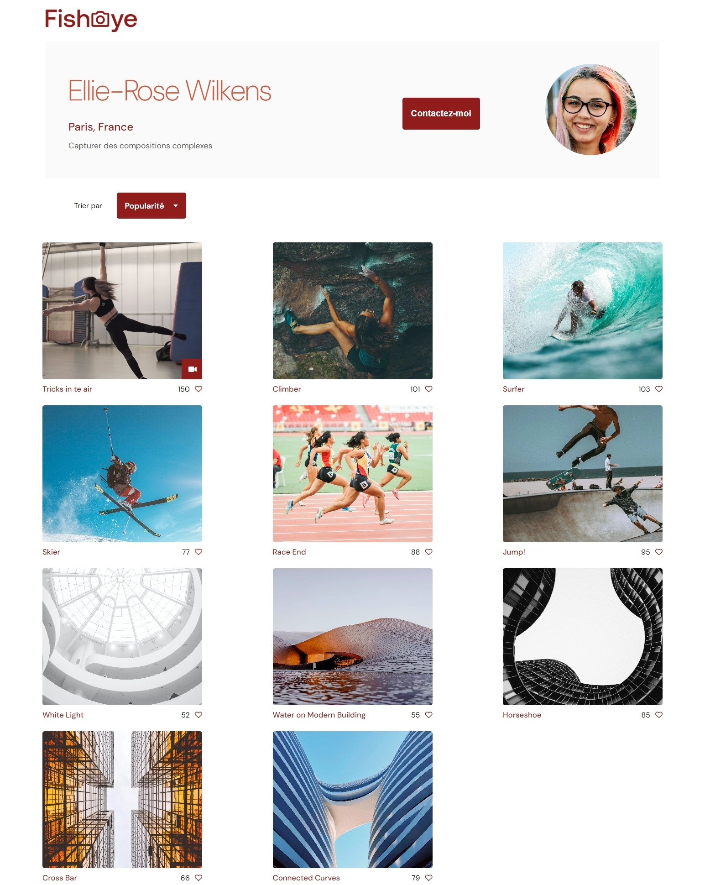
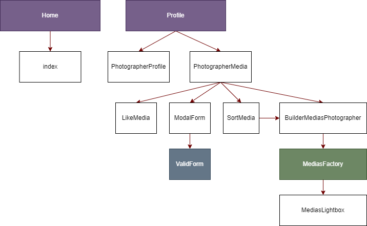

<style>
    img {
        width: 50%;
    }

    .demo {
        height: 35%;
        width: 35%;
    }
</style>

# Projet 6 - FishEye

Sixième projet de la formation OpenClassrooms : Développeur d'applications Javascript/React.
Objectif : 
- Récupération et mappage de données
- Créer un site utilisant des Designs Pattern (Constructor & Factory Pattern)
- Gestion du responsive (Desktop / Tablette / Mobile)

## Installation

Les librairies intégrées au projet sont : <br />
\- Font-Awesome <br />
\- Eslint <br /> <br />
Pour récupérer le projet, clonez directement ce repository puis faites un ``` npm install ```. <br />

## Demo



## Organigramme 

L'arborescence des fichiers et features en javascript s'organisent de la sorte : <br />

